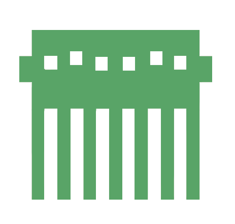
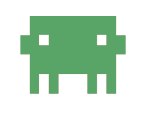

# Claw'd Forge

**A visual desktop dashboard for Claude's `workflow` skill.**

Claw'd Forge is an Electron app that runs the Claude CLI as a hidden headless process and renders its work as a live, interactive UI — a presearch wizard you click through, a build dashboard that tracks phases and tasks, and an animated lobster mascot named Claw'd who changes costume depending on what Claude is doing.

No terminal. No scrolling walls of text.

---

## Why

Claude's `workflow` skill is powerful but produces dense terminal output that's hard to scan. You can't tell at a glance which phase you're in, which questions are waiting on you, or what just broke.

Claw'd Forge takes the exact same workflow and makes it **visual, interactive, and fun**:

- **Presearch** becomes a card-based wizard — click options instead of typing answers.
- **Build progress** becomes a phase stepper with task cards, blocker alerts, and a completion summary.
- **The whole thing** gets a mascot who wears a detective hat during constraint gathering and a hard hat during the build.

---

## Screenshots

| Orchestrator | Subagents |
|---|---|
|  |  |

---

## Quick Start

**Prerequisites:** Node.js 18+, and the [Claude CLI](https://claude.com/claude-code) installed and authenticated (`claude` on your PATH).

```bash
git clone <repo-url>
cd clawdForge
npm install
npm start
```

Then in the app:

1. **Pick a project directory** with the native folder picker.
2. **Select a PRD** — Claw'd Forge auto-detects markdown files in the directory. No PRD? Type a description instead.
3. **Choose a run mode** — *Interactive* (you answer presearch questions) or *Autonomous* (Claude decides and builds straight through).
4. **Hit go.** Watch Claw'd work.

If a previous session was interrupted, the launch screen detects `WORKFLOW_STATE.md` and offers to resume.

---

## How It Works

The core idea is **disk-state architecture**: Claude doesn't stream status through text that we parse — it writes structured JSON to a `.forge/` directory, and the dashboard reads it.

```
+----------------------------------------------------------+
|                    Electron Shell                        |
|                                                          |
|  +-------------------+     IPC      +------------------+ |
|  |   Main Process    | <==========> |    Renderer      | |
|  |                   |              |                  | |
|  |  claude-runner.js |              |  App.jsx (Preact)| |
|  |  event-bus.js     |              |  Components/     | |
|  |  forge-state-     |              |  Hooks/          | |
|  |   watcher.js      |              |                  | |
|  |  jsonl-parser.js  |              |  ClawdStage.jsx  | |
|  |  gate-check.js    |              |  (Canvas 30fps)  | |
|  +--------+----------+              +------------------+ |
|           | spawns                                       |
|  +--------v----------+                                   |
|  |    Claude CLI     |                                   |
|  | (child process)   |                                   |
|  | stream-json stdout|                                   |
|  | .forge/ disk state|                                   |
|  +-------------------+                                   |
+----------------------------------------------------------+
```

**The loop:**

1. You pick a directory and PRD on the Launch Screen.
2. Electron spawns the Claude CLI with `--output-format stream-json`.
3. Claude writes structured JSON into `.forge/` as it works.
4. `ForgeStateWatcher` polls `.forge/` every 500ms and diffs against the previous state.
5. Granular events (`mode-change`, `phase-change`, `waiting-for-input`, …) go to the renderer over IPC.
6. Preact components re-render; the Canvas draws Claw'd at 30fps in the costume matching the current phase.
7. Your presearch answers get written to `.forge/user-input.json`, which Claude picks up and continues from.

### `.forge/` state files

| File | Purpose | Written by |
|---|---|---|
| `state.json` | Master state — mode, status, elapsed | Claude |
| `presearch-state.json` | Questions, options, decisions, current loop | Claude |
| `build-state.json` | Phases, tasks, blockers, completion | Claude |
| `config-required.json` | Post-build env vars needed | Claude |
| `user-input.json` | Your answer to an interactive question | Dashboard |

A **gate-check Stop hook** is installed into Claude's settings and runs after every turn — it validates that every `.forge/` file exists and parses, blocking the turn if state ever goes corrupt.

---

## Features

### Launch Screen
Native directory picker, auto-detected PRD chips, free-text description fallback, autonomous/interactive toggle, and resume detection for interrupted sessions.

### Presearch Wizard
A 5-loop interactive flow — **Constraints → Discovery → Refinement → Plan → Gap Analysis** — driven by card types:

- **QuestionCard** — multiple choice with expandable options, recommended badges, and pros/cons
- **TextCard** — free-text input
- **DecisionCard** — locked, read-only decisions
- **RegistryCard** — technology selections with priority metadata
- **AccordionCard** — expandable detail sections
- **RequirementsPanel** — live sidebar of extracted requirements

### Build Dashboard
- **PhaseStepper** — horizontal roadmap of build phases
- **CardLog** — scrollable task history with smart auto-scroll (pauses when you scroll up)
- **TaskCard** — name, status badge, commit hash, duration
- **BlockerCard / FailureCard / ContextCard** — intervention, fatal errors, context-window warnings
- **PauseScreen / CompletionScreen / ConfigScreen** — paused overlay, success summary, post-build env config

### Claw'd
A Canvas-rendered mascot on a fixed 180px stage running a 30fps loop, with **14 costumes** mapped to workflow phases (detective, architect, scientist, planner, critic, builder, coach, foreman, inspector, rocket, party, error, coffee, idle) and mini-Claw'd helper sprites — up to 6 at once — that slide in and out to represent active subagents.

---

## Tech Stack

| Layer | Technology | Why |
|---|---|---|
| Desktop shell | Electron ^30.5 | Child processes, native dialogs, IPC |
| UI | Preact ^10.25 | 3kb React alternative with full compat layer |
| Bundler | Vite ^6 | Fast HMR, JSX via `@preact/preset-vite` |
| Canvas | Vanilla JS | 30fps loop, pixel-perfect control, zero library overhead |
| Styling | Vanilla CSS + custom properties | Design tokens, no CSS-in-JS build cost |
| Testing | Vitest + `@testing-library/preact` + jsdom | Same bundler as prod |
| Linting | ESLint ^9 (flat config) | — |
| Packaging | electron-builder ^26 | Produces a `.exe` installer |

Only **two runtime dependencies**: `preact` and `electron-reload`.

---

## Commands

| Command | Purpose |
|---|---|
| `npm start` | Run the app (`launch.js` → Electron) |
| `npm run dev` | Vite dev server on port 5173 |
| `npm run dev:build` | Build renderer only, no packaging |
| `npm test` | Run all tests |
| `npm run test:watch` | Watch-mode testing |
| `npm run lint` | ESLint check |
| `npm run quality` | Lint + tests |
| `npm run build` | Full build: Vite → `dist-renderer`, then electron-builder → `.exe` |

> `launch.js` exists because VS Code and Claude Code set `ELECTRON_RUN_AS_NODE`, which breaks Electron's GUI mode. It clears that var and spawns Electron with inherited stdio.

---

## Project Structure

```
src/
  App.jsx              # Root component — routes launch/presearch/build/complete
  bridge/              # Main-process modules (CommonJS)
    claude-runner.js   #   spawns Claude, installs hooks, wires everything
    event-bus.js       #   ForgeBus EventEmitter
    forge-state-watcher.js  # polls .forge/ every 500ms
    jsonl-parser.js    #   streaming JSON Lines parser
    gate-check.js      #   Stop-hook validator
  clawd/               # Canvas mascot system
    stage-renderer.js  #   30fps render loop
    clawd-mascot.js    #   mascot class, 14 costumes
    helpers.js         #   subagent helper sprites
  components/
    presearch/         # 9 wizard components
    build/             # 10 build dashboard components
    shared/            # Card, Button, Badge, ProConList
  hooks/               # useElapsedTimer, useForgeAPI, useForgeState
  styles/              # theme.css (tokens), global.css
test/                  # 35 test files mirroring src/
main.js                # Electron main process
preload.js             # Context-isolated IPC bridge (window.forgeAPI)
launch.js              # ELECTRON_RUN_AS_NODE workaround
```

---

## Testing

```bash
npm test          # 284 tests across 35 files
npm run quality   # lint + tests
```

Coverage spans bridge modules (spawn, JSONL parsing, resume, cleanup), state watching and diffing, gate-check validation, state machines, all Preact components, hooks, canvas modules, and end-to-end disk-state integration flows.

Development followed strict TDD — failing test first, minimal implementation, then refactor — with all coding done in isolated git worktrees merged via `--no-ff`.

---

## Design Tokens

Everything pulls from `src/styles/theme.css`. Never hardcode a color.

```css
--surface-base: #0E0E0E;    --primary: #E8734A;
--surface-raised: #1A1A1A;  --text-primary: #FAF0E6;  /* cream */
--surface-overlay: #252525; --text-secondary: #C4A882; /* tan */
--error: #E84A4A;           --warning: #E8B44A;        --tertiary: #4AA8E8;
```

---

## Known Limitations

- **Placeholder sprites** — Claw'd and helpers currently render as colored rectangles with costume labels; real sprite sheets are pending.
- **Unsigned executable** — triggers Windows Defender SmartScreen.
- **Windows-first** — not yet tested on macOS or Linux.
- **No debug terminal** — the terminal is hidden by design; troubleshooting goes through DevTools console.
- **No live end-to-end run** — parsing edge cases may surface in long real-world sessions.
- **Canvas isn't responsive** — it redraws on resize but doesn't adapt aspect ratios.
- **48 ESLint warnings** — mostly unused-var false positives from JSX patterns. Zero errors.

---

## Further Reading

| Document | Contents |
|---|---|
| [`BUILD_SUMMARY.md`](BUILD_SUMMARY.md) | Full technical breakdown — every module, skill, and hook |
| [`PRESEARCH.md`](PRESEARCH.md) | The locked PRD; central authority for all decisions |
| [`FUTURE.md`](FUTURE.md) | v3 roadmap |
| [`decisions/`](decisions/) | Architecture Decision Records |
| [`memory-bank/`](memory-bank/) | Cross-session project context (6-file structure) |
| [`.claude/CLAUDE.md`](.claude/CLAUDE.md) | Development rules and quality gates |
